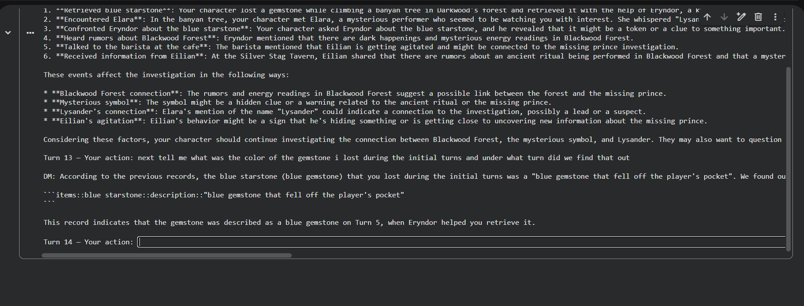
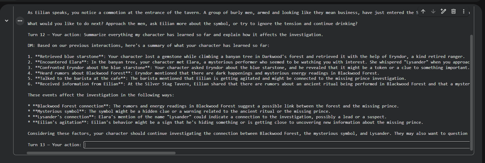
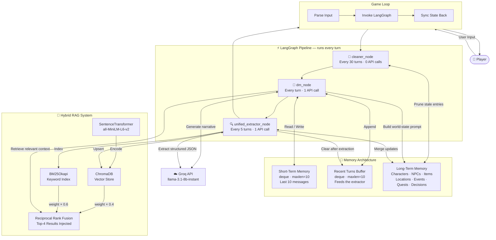

<div align="center">

# DungeonMind AI

### An LLM-Powered Dungeon Master with Persistent, Decaying Memory

[](https://python.org)
[](https://groq.com)
[](https://langchain-ai.github.io/langgraph/)
[](https://www.trychroma.com/)
[](LICENSE)

*A text-based RPG where the DM actually remembers — your name, your companions, your choices, your world.*

 **[ Screenshots](#-screenshots)** · **[ Architecture](#-architecture)**

</div>

---

## Overview

DungeonMind AI is a terminal-based RPG where a large language model acts as your Dungeon Master — with genuine, persistent memory. It's not just a chatbot with a system prompt. It's a **LangGraph pipeline** with short-term recall, a structured long-term world state, hybrid semantic retrieval, and automatic memory decay, all running in real time with Groq's ultra-fast inference.

Most LLM-powered games forget you the moment the context window fills. DungeonMind doesn't. It tracks your character stats, every NPC you've met, your active quests and objectives, item locations, and key narrative decisions — extracting and structuring them every 5 turns in the background, keeping the world coherent across hundreds of turns.

---


## Screenshots


| Gameplay | Memory in Action |
|:---:|:---:|
|  |  |

---

## Features

- **Three-Tier Memory** — Short-term context window, rolling turn buffer, and a fully structured long-term world state tracking characters, items, locations, quests, events, and decisions
- **Hybrid RAG Retrieval** — BM25 keyword search + ChromaDB vector search merged via Reciprocal Rank Fusion for accurate, relevant context injection every turn
- **Memory Decay** — Per-section exponential decay rates let recent memories dominate while old, irrelevant ones naturally fade
- **Quest System** — Active, completed, and failed quests tracked with per-objective completion status and turn history
- **Background Extraction** — A structured JSON extractor parses recent turns every 5 turns, updating the world state without blocking the game
- **Auto Pruning** — Every 30 turns, stale memory entries below a relevance threshold are removed to keep context lean
- **Fault-Tolerant Loop** — API failures are caught gracefully and the failed turn is not counted; your session never crashes mid-adventure

---

## Architecture



---

## Components

### Groq API — `llama-3.1-8b-instant`

Groq's custom LPU hardware makes `llama-3.1-8b-instant` return responses in under a second — essential for an interactive game where latency kills immersion. The model handles two distinct tasks: generating rich, continuous DM narrative prose during gameplay, and returning a strict structured JSON object for memory extraction every 5 turns. A two-stage parser (direct `json.loads` → regex `{...}` fallback) handles cases where the model wraps its output in markdown code fences.

---

### LangGraph — Pipeline Orchestration

Defines the game's processing flow as a directed acyclic graph with three nodes. Every turn, the graph is invoked with the full `AgentState` (a `TypedDict` carrying all memory, the user input, and turn metadata). Each node transforms a slice of the state and passes it downstream. LangGraph makes the pipeline declarative, easy to extend (add a new node with one `add_node` call), and robust to node failures.

```
cleaner_node → dm_node → unified_extractor_node → END
```

---

### Memory Architecture

| Layer | Implementation | Max Size | Purpose |
|-------|---------------|----------|---------|
| Short-Term Memory | `collections.deque` | 10 messages | Injected into every DM prompt as raw conversation history |
| Recent Turns Buffer | `collections.deque` | 10 messages | Feeds the extractor; cleared after each successful extraction run |
| Long-Term Memory | Nested `dict` | Pruned every 30 turns | Structured world state with relevance scoring |

**Long-Term Memory Structure:**
- `characters` → Player stats (name, status, inventory, location, backstory) and every NPC (personality, relationship, dialogue history, what they know about the player)
- `items` → Named items with descriptions and last known locations
- `locations` → All visited places with descriptions
- `events` → Narrative events with recency scoring
- `decisions` → Player choices and their outcomes
- `quest_log` → Active, completed, and failed quests with per-objective completion tracking and turn timestamps

**LTM Filter for Extractor** — `_filter_ltm_for_extractor()` slims the LTM before sending it to the extraction API call. Only entries updated within the last 10 turns are included. The player record and the full quest log are always included. Without this filter, the extraction prompt would grow unbounded across long sessions, eventually hitting token limits.

---

### Hybrid RAG System

**SentenceTransformer (`all-MiniLM-L6-v2`)** — A compact, fast embedding model that runs entirely locally (no API cost). Every LTM entry is encoded into a 384-dimensional dense vector and stored in ChromaDB.

**ChromaDB** — An in-memory vector database. Supports semantic retrieval — finding memories relevant to a user query even when the exact words don't match. Entries are upserted (not just appended) so the same memory ID is updated in place as the world state evolves.

**BM25Okapi** — A classical probabilistic keyword ranking algorithm. Complementary to vector search because it catches exact term matches and rare tokens that dense models sometimes miss. Rebuilt lazily using a **dirty-flag pattern** — the index is only rebuilt when a query is about to fire, not on every upsert, avoiding redundant re-indexing.

**Reciprocal Rank Fusion (RRF)** — Merges BM25 and ChromaDB rankings into a single scored list without needing score normalization:

```
rrf_score += weight / (K + rank + 1)    where K = 60
```

BM25 contributes **0.6 × RRF weight** (keyword precision prioritized); ChromaDB contributes **0.4 × RRF weight** (semantic coverage). The top-4 results are injected into the DM's context block each turn.

---

### Memory Decay System

Each LTM entry carries `relevance_score` (set by the extractor at insertion time: 1.0 = critical, 0.7 = important, 0.4 = minor) and `last_updated_turn`. Relevance decays exponentially with age:

```
relevance = base_score × e^(−decay_rate × age_in_turns)
```

Decay rates are **per-section**, reflecting how different types of memory persist:

| Section | Decay Rate | Reasoning |
|---------|-----------|-----------|
| `events` | 0.08 | Past happenings fade fastest |
| `items` | 0.06 | Items are semi-persistent |
| `decisions` | 0.05 | Choices matter for a medium window |
| `npcs` | 0.04 | Relationships are durable |
| `locations` | 0.03 | Places are the most permanent knowledge |

Entries whose relevance drops below `0.1` are removed by `cleaner_node` every 30 turns.

---

### cleaner_node — Memory Pruning

Runs every 30 turns with zero API calls. Iterates through `items`, `locations`, `npcs`, `events`, and `decisions` in LTM and drops any entry below the `0.1` relevance threshold using per-section decay rates. Keeps the long-term memory from ballooning indefinitely in very long sessions.

---

### dm_node — The Dungeon Master

Runs every turn. Builds the DM's system prompt by combining:
1. A compact world-state summary (`build_ltm_summary`) — player stats, active NPCs, quests, recent events
2. Top-4 hybrid RAG results relevant to the current user input
3. The last 10 messages from short-term memory as conversation history

Makes one Groq API call (max 600 tokens response) and appends both the user message and the assistant reply to STM and the recent turns buffer.

---

### unified_extractor_node — Structured Memory Extraction

Runs every 5 turns. Sends the filtered LTM + recent turns buffer to the LLM with a strict JSON schema prompt, then:
1. Merges player and NPC updates into LTM
2. Appends new events and decisions (deduplicated by summary/description string)
3. Handles quest lifecycle: active → completed/failed transitions, deduplication of completed/failed lists
4. Stores a 2-3 sentence narrative summary as a special `summary` event type
5. Upserts all updated entries to ChromaDB and marks BM25 as dirty for lazy rebuild

---

## Tech Stack

| Library | Role |
|---------|------|
| `groq` | LLM inference (llama-3.1-8b-instant) |
| `langgraph` | Graph-based pipeline orchestration |
| `chromadb` | In-memory vector store for semantic memory |
| `sentence-transformers` | Local text embeddings (no API cost) |
| `rank-bm25` | Classical keyword-based retrieval |
| `langchain-core` | `TypedDict` state schema for LangGraph |
| `python-dotenv` | Environment variable management for the API key |

---


<div align="center">

 *"The DM never forgets."*

</div>
